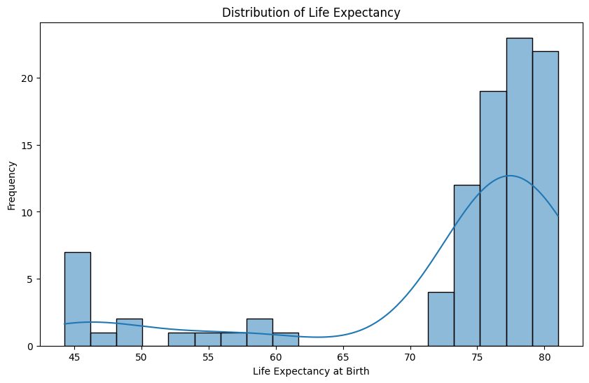
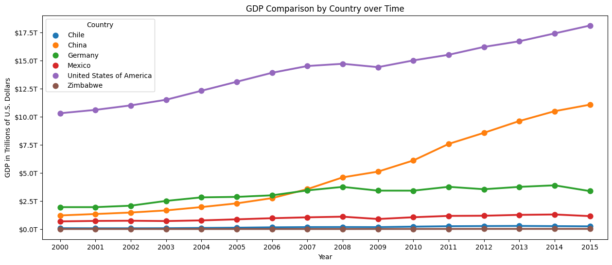
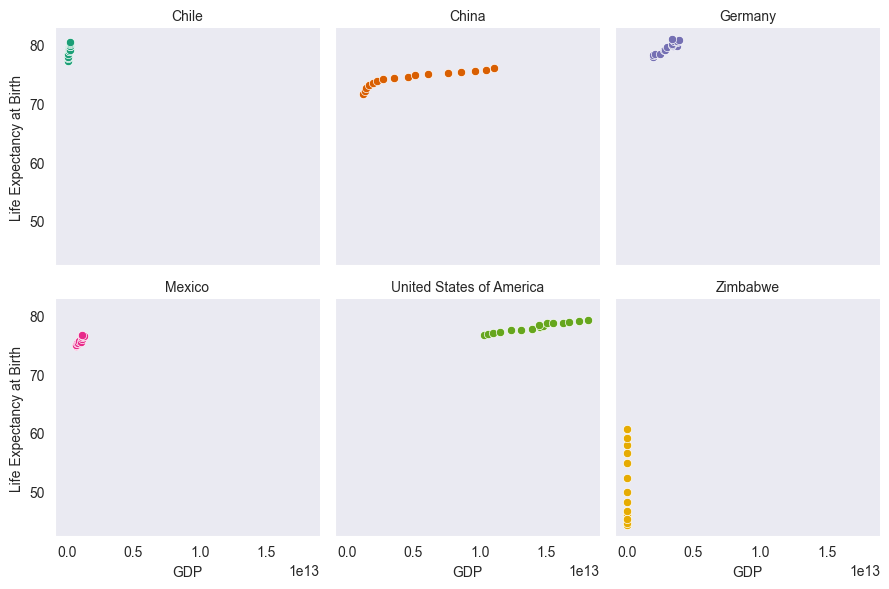
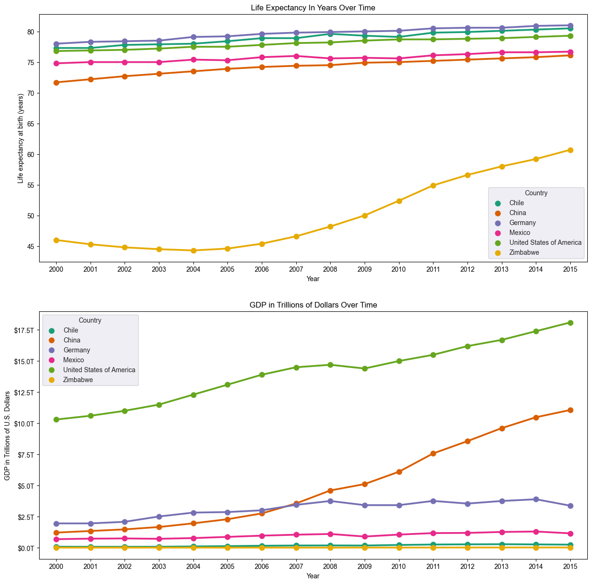
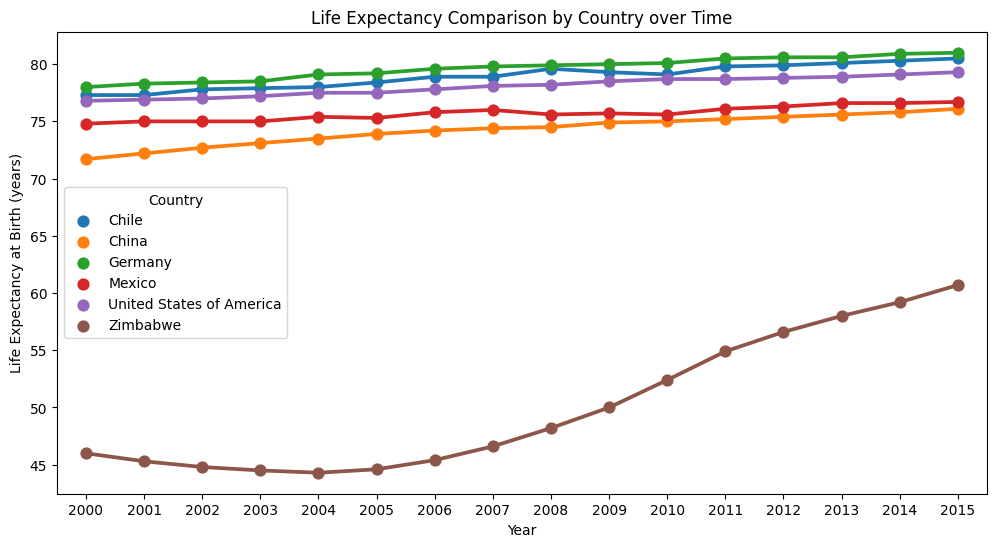

# Investigating the Correlation between GDP and Life Expectancy

## Introduction

__Goals__: 

This project aims to analyse the Gross Domestic Product (GDP) and life expectancy statistics to see whether there is a correlation or pattern between a nation's economic wealth (as measured by GDP) and its population's life expectancy. The findings will provide evidence to support the view that an unfair relationship exists between a country's riches and its people's well-being.

__Analysis__: 

To conduct an exploratory data analysis (EDA) for this project, we will:
* Preprocess the data by cleaning and organising it for analysis.
* Calculate relevant statistical measures such as means, medians, and standard deviations for GDP and life expectancy.
* Visualise the data using plots, such as scatter plots, line graphs, or bar charts, to observe any patterns or trends between GDP and life expectancy.
* Conduct correlation analysis to determine the strength and direction of the relationship between GDP and life expectancy.
* Interpret the findings and conclude the presence or absence of a correlation between GDP and life expectancy.

By following these steps, we aim to provide empirical evidence to support the Vice President of Intuition and Systems at IHEAL's claim regarding the correlation or pattern between a nation's GDP and the life expectancy of its people.

## Requirements
- Python 3.x
- Jupyter Notebook
- Libraries: pandas, matplotlib, seaborn

## Analysis

### Distribution of Life Expectancy

*In-depth interpretation and discussion here.*

### GDP Comparison by Country

*In-depth interpretation and discussion here.*

### LEABY Scatterplot

*In-depth interpretation and discussion here.*

### Life Expectancy and GDP

*In-depth interpretation and discussion here.*

### Life Expectancy Comparison by Country

*In-depth interpretation and discussion here.*

## Conclusion

Based on our analysis, we have found the following:

The findings indicate a significant positive correlation between a country's GDP and life expectancy. Countries with higher GDP tend to have higher life expectancies on average. However, it is essential to note that correlation does not imply causation. Other factors like healthcare systems, education, social policies, and living conditions can also influence life expectancy.

It is worth mentioning that while a correlation exists, the Vice President of Intuition and Systems at IHEAL's claim about an "unjust connection" between wealth and well-being requires further investigation. The complex relationship between socioeconomic factors and population health necessitates a nuanced understanding beyond a simple correlation.

In conclusion, our analysis provides compelling evidence supporting the existence of a correlation between GDP and life expectancy. This information can be instrumental in driving discussions and policies to improve individuals' well-being within different nations. However, it is vital to approach the subject with a holistic perspective, considering multiple factors that contribute to a population's health and well-being.

## Acknowledgments

__Data Sources__:

The full datasets can be found bellow:

* GDP Data: The World Bank's national accounts data and OECD National Accounts data files. ([World Bank GDP Data](https://data.worldbank.org/indicator/NY.GDP.MKTP.CD))
* Life Expectancy Data: The World Health Organization's data repository. ([WHO Life Expectancy Data](vhttp://apps.who.int/gho/data/node.main.688))
* The compiled version used in "/data/all_data", to make the analysis was downloaded from [MARGARET GATHONI](https://www.kaggle.com/datasets/margaretgathoni/gdp-dataset-for-learning-visualization)'s Kaggle.
